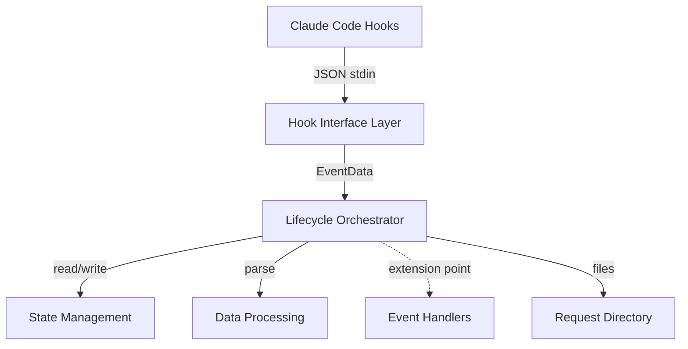

# Architecture

**Last Updated**: 2025-12-12

---

## Overview

Claude Code Toolbox provides infrastructure for agent coordination. The system uses [Claude Code hooks](docs/claude-code-reference.md#hooks) to observe agent execution and persist context, enabling agents to coordinate across sessions without tight coupling.

---

## Agent Lifecycle System

### Purpose

Capture what happens during a user request: what the user asked for, which agents ran, what context they produced, and what work they generated.

### Architecture

The lifecycle system follows a layered architecture separating concerns:

**Hook Interface** (`agent-lifecycle.py`): Translates hook protocol (stdin/exit codes) to Python exceptions. Minimal layer with no business logic.

**Orchestrator** (`lifecycle/orchestrator.py`): Coordinates event processing, manages request lifecycle, executes side effects. Contains all framework logic for capturing user prompts, tracking agents, extracting outputs, and persisting state.

**State Management** (`lifecycle/state.py`): Dual-file storage (global + request-scoped) with dirty tracking and atomic writes.

**Data Processing** (`lifecycle/processing.py`): Transforms hook inputs, parses agent tags, extracts session log snapshots, validates fields.

**Event Handlers** (`lifecycle/handlers.py`): Extension point for future business logic. Currently unused—all logic lives in orchestrator framework methods.

### How It Works

**Request Scoping**: Each user prompt creates a request directory under `.toolbox/events/`. Everything related to that request—user prompt, agent outputs, session logs, hook events—goes there.

**Hook Integration**: Five hook events drive the lifecycle:
- **SessionStart** - Creates `.toolbox/events/` directory
- **UserPromptSubmit** - Generates request ID, creates request directory, writes prompt to `context.md`
- **SubagentStart** - Records agent type in state
- **SubagentStop** - Extracts `<context>` and `<work>` tags from agent output, appends to `context.md`, copies transcript
- **Stop** - Extracts request-specific session log snapshot

**State Management**: Two-tier state storage:
- Global state (`.toolbox/events/.global-state.json`) - Maps session_id → request_id for concurrent sessions
- Request state (`{request_dir}/.state.json`) - Stores start_uuid and agent_types mapping

**Processing Flow**:
1. Hook fires → JSON stdin → Interface layer
2. Interface creates EventData, invokes orchestrator
3. Orchestrator determines request context (create or lookup request_id)
4. Orchestrator executes event-specific framework method
5. Framework method writes files immediately (context.md, transcripts, session logs)
6. Orchestrator persists state changes
7. Orchestrator logs hook event to audit trail
8. Interface exits with appropriate code (0/1/2)

**Why Hooks**: Hooks run outside agent context, allowing passive observation. Agents don't need to know about the orchestration system—they just output tags if they want to share context or create artifacts.

### What Gets Stored

Each request directory contains:
- `context.md` - User prompt + agent context extracts
- `work/` - Files agents create via `<work filename="...">` tags
- `session-logs/` - Agent transcripts (`agent-{id}.jsonl`) and pruned session log (`{session_id}-pruned.jsonl`)
- `hook-events.jsonl` - Complete audit trail
- `.state.json` - Request-scoped state (start_uuid, agent_types)

### Error Handling

Two error types with distinct semantics:
- **BlockingError** (exit 2) - Validation failures that should block the operation and notify the agent
- **NonBlockingError** (exit 1) - I/O failures logged but allow operation to continue

Best-effort semantics: lifecycle tracking is observational and never breaks user workflow.

### Extension Points

System designed for future enhancement without restructuring:
- **Event Handlers**: Add domain-specific logic by implementing EventHandler interface
- **File Operations**: FileOperation model supports declarative file operations (currently unused)
- **Agent-Specific Routing**: `_get_handler()` can route based on agent type
- **New Events**: Add event-specific framework methods to orchestrator

### Why This Design

**Agent Independence**: Agents remain simple. They output text tags; the system extracts them. No special tools or coordination logic required.

**Request Isolation**: Each request is self-contained. No cross-contamination between requests, easy to analyze or replay individual requests.

**File-Based State**: No databases or external services. Works anywhere Claude Code runs. Human-inspectable for debugging.

**Testability**: Clear separation between framework (orchestrator methods) and business logic (handlers). Pure functions enable easy testing.

**Extensibility**: Extension points established without implementation. Add handlers when needed, no restructuring required.

---

## Future Systems

As new orchestration capabilities are added (multi-agent workflows, work queues, session resumption), they will be documented here.
